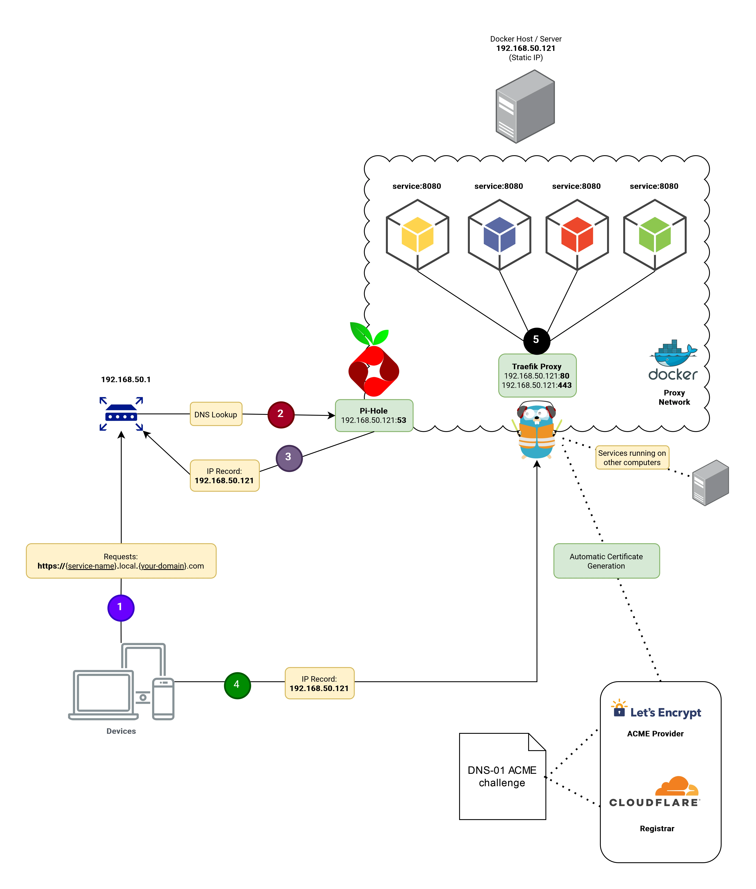

# Home Lab Setup with SSL

I used [Techno Tim's](https://www.youtube.com/@TechnoTim) guide [Put Wildcard Certificates and SSL on EVERYTHING](https://technotim.live/posts/traefik-portainer-ssl) while setting up my home lab.
I highly recommend watching the video and reading his guide. I will be using the same tools and techniques as Tim but will be primarily focusing on documenting my personal setup.

## Prerequisites

- Access to your Router:
    - Used for configuring local DNS and static IP addresses.
    - I use an [RT-AXE7800](https://www.asus.com/networking-iot-servers/wifi-routers/asus-wifi-routers/rt-axe7800/) router.
- A docker host:
    - Refer to [Docker's documentation](https://docs.docker.com/engine/install) for installation instructions.
    - I use [Ubuntu 22.04.3 LTS](https://releases.ubuntu.com/jammy) as my host operating system.
    - See [PC-Part Picker](https://pcpartpicker.com/list/jW6prv) for my server build.
- A domain name that you own:
    - This will cost approximately ~$10 USD per year depending on the domain name.
    - I use [CloudFlare](https://www.cloudflare.com/products/registrar).
- All the necessary env files. See [Environment Variables & .env files](./docker-volumes/env-files/README.md) for more information.

## Conventions

### Service Directory Structure

The following directory structure is used for each service:

```text
service-name/
├── data
│   ├── folder-1
│   ├── folder-2
│   └── ...
└── docker-compose.yaml
```

For multiple services that share the same docker-compose file, the following structure is used instead:

```text
./application-name/
├── service-1
│   └── data
├── service-2
│   └── data
└── docker-compose.yaml
```

The data folder is used for any [bind mounts](https://docs.docker.com/storage/bind-mounts). (You can also use [named volumes](https://docs.docker.com/storage/volumes/) instead).



## Configure Static IP for the Docker Host

The first step is to configure a static IP address for the docker host so that we don't have to worry about having to update DNS records if the server IP gets re-assigned.

You can run the following command to get the IP address of your docker host:

```bash
#!/usr/bin/env bash

hostname -I

```

Regarding the router configuration, you can follow the instructions provided by ASUS for [assigning a static IP address](https://www.asus.com/support/FAQ/1000906) for their routers. The instructions should be similar for other routers.

## Core Setup

### Docker Network Setup

```bash
#!/usr/bin/env bash

docker network create proxy

```

All services will belong to this network and traefik will route traffic to the appropriate service.
As such, typically, we will **not** be [publishing ports](https://docs.docker.com/network/#published-ports) for our services except for traefik and pi-hole.

### Pi-Hole

#### Ubuntu Specific Configuration

For Ubuntu, the container will fail to start if the `systemd-resolved.service` is running.

As such, as per the [pi-hole documentation](https://github.com/pi-hole/docker-pi-hole#installing-on-ubuntu-or-fedora), you'll need to either disable the stub resolver:

```bash
#!/usr/bin/env bash

# Disable Stub Resolver
sudo sed -r -i.orig 's/#?DNSStubListener=yes/DNSStubListener=no/g' /etc/systemd/resolved.conf
# Update nameserver setting
sudo sh -c 'rm /etc/resolv.conf && ln -s /run/systemd/resolve/resolv.conf /etc/resolv.conf'
# Restart the Service
sudo systemctl restart systemd-resolved

```

**Or** disable the `systemd-resolved.service` entirely i.e.

```bash
#!/usr/bin/env bash

sudo systemctl disable systemd-resolved.service
sudo systemctl stop systemd-resolved.service
```

#### Start the Service

Start the [pi-hole service](./docker-volumes/pi-hole) as follows:

```bash
#!/usr/bin/env bash

docker compose \
  --env-file "./docker-volumes/env-files/common.env" \
  --env-file "./docker-volumes/env-files/pi-hole.env" \
  --file "./docker-volumes/pi-hole/docker-compose.yaml" up --detach
```

The web UI will be accessible via the following URL: [http://${DOCKER_HOST_IP}/admin](http://localhost/admin)

**Note**: After traefik is up, you can access the web UI via the following URL: [https://pi-hole.local.$LOCAL_DOMAIN/admin](https://pi-hole.local.$LOCAL_DOMAIN/admin)

#### Update Router DNS Settings

You'll need to update your router's DNS settings to use the Pi-Hole service after it is up and running.

You can follow the instructions provided by ASUS for [configuring a custom DNS server](https://www.asus.com/support/FAQ/1045253/) for their routers. The instructions should be similar for other routers.

### Traefik

Start the [traefik service](./docker-volumes/traefik/docker-compose.yaml) as follows:

```shell
#!/usr/bin/env bash

docker compose \
  --env-file "./docker-volumes/env-files/common.env" \
  --env-file "./docker-volumes/env-files/traefik.env" \
  --file "./docker-volumes/traefik/docker-compose.yaml" up --detach
```

### Portainer

Start the [portainer service](./docker-volumes/portainer/docker-compose.yaml) as follows:

```bash
#!/usr/bin/env bash

docker compose \
  --env-file "./docker-volumes/env-files/common.env" \
  --file "./docker-volumes/portainer/docker-compose.yaml" up --detach
```

## Services

For any new service, ensure that the network we created earlier is used and that the following labels are defined:

```yaml 
version: "3.9"
services:
  service-name:
    image: "image-name:latest"
    container_name: "container-name"
    restart: "unless-stopped"
    networks:
      - "proxy"
    labels:
      - "traefik.enable=true"
      - "traefik.http.routers.${SERVICE_NAME}.entrypoints=http"
      - "traefik.http.routers.${SERVICE_NAME}.rule=Host(`${SERVICE_NAME}.local.$LOCAL_DOMAIN_NAME`)"
      - "traefik.http.middlewares.${SERVICE_NAME}-https-redirect.redirectscheme.scheme=https"
      - "traefik.http.routers.${SERVICE_NAME}.middlewares=${SERVICE_NAME}-https-redirect"
      - "traefik.http.routers.${SERVICE_NAME}-secure.entrypoints=https"
      - "traefik.http.routers.${SERVICE_NAME}-secure.rule=Host(`${SERVICE_NAME}.local.$LOCAL_DOMAIN_NAME`)"
      - "traefik.http.routers.${SERVICE_NAME}-secure.tls=true"
      - "traefik.http.routers.${SERVICE_NAME}-secure.service=${SERVICE_NAME}"
      - "traefik.http.services.${SERVICE_NAME}.loadbalancer.server.port=${SERVICE_PORT}"
      - "traefik.docker.network=proxy"
networks:
  proxy:
    external: true
```

**Note:** Include the following label if you [don't want Watchtower to automatically update the container](https://containrrr.dev/watchtower/container-selection/):

```yaml
version: "3.9"
services:
  someimage:
    container_name: someimage
    labels:
      - "com.centurylinklabs.watchtower.enable=false"
```

### Calibre Web

> Calibre-Web is a web app that offers a clean and intuitive interface for browsing, reading, and downloading eBooks using a valid Calibre database.

- [docker-compose.yaml](./docker-volumes/calibre-web/docker-compose.yaml)
- [Calibre Web - Installation Instructions](https://docs.linuxserver.io/images/docker-calibre-web/)

### Dashdot

> A modern server dashboard, running on the latest tech, designed with glassmorphism in mind. It is intended to be used for smaller VPS and private servers.

- [docker-compose.yaml](./docker-volumes/dashdot/docker-compose.yaml)
- [Dashdot - GitHub](https://github.com/MauriceNino/dashdot)

### Homarr

> A simple, yet powerful dashboard for your server.

- [docker-compose.yaml](./docker-volumes/homarr/docker-compose.yaml)
- [Homarr - Installation Instructions](https://homarr.dev/docs/getting-started/installation/#-docker-compose)

### Jenkins

> The leading open source automation server

- [docker-compose.yaml](./docker-volumes/jenkins/docker-compose.yaml)
- [Jenkins - Dockerhub](https://hub.docker.com/r/jenkins/jenkins)

### Nexus Repository Manager

> Nexus by Sonatype is a repository manager that organizes, stores and distributes artifacts needed for development.

- [docker-compose.yaml](./docker-volumes/nexus/docker-compose.yaml)
- [Nexus Repository Manager - Dockerhub](https://hub.docker.com/r/sonatype/nexus3)

### Pi-Hole

> Network-wide Ad Blocking

- [docker-compose.yaml](./docker-volumes/pi-hole/docker-compose.yaml)
- [Pi Hole Docker Quick Start](https://github.com/pi-hole/docker-pi-hole/#quick-start)
- [Documentation](https://docs.pi-hole.net/)
- [Firebox Ad Lists](https://firebog.net/)

### Portainer

> Portainer is your container management software to deploy, troubleshoot, and secure applications across cloud, datacenter, and Industrial IoT use cases.

- [docker-compose.yaml](./docker-volumes/portainer/docker-compose.yaml)
- [Portainer - Installation Instructions](https://docs.portainer.io/start/install-ce)

### Postgres and PgAdmin

- [docker-compose.yaml](./docker-volumes/postgres/docker-compose.yaml)

> PostgreSQL is a powerful, open source object-relational database system

- [Postgres - Dockerhub](https://hub.docker.com/_/postgres)

> the most popular and feature rich Open Source administration and development platform for PostgreSQL

- [PgAdmin - Dockerhub](https://hub.docker.com/r/dpage/pgadmin4)

Note: With bind mounts, you may need to change the GUI and UID to `5050`.
See [Permission denied: '/var/lib/pgadmin/sessions' in Docker](https://stackoverflow.com/questions/64781245/permission-denied-var-lib-pgadmin-sessions-in-docker) for more information.

```bash
#!/usr/bin/env bash
sudo chown -R 5050:5050 "$BASE_VOLUME_DIRECTORY/admin/data"
```

### SonarQube

> the code quality tool for better code

- [docker-compose.yaml](./docker-volumes/sonarqube/docker-compose.yaml)
- [SonarQube - Dockerhub](https://hub.docker.com/_/sonarqube)

Note: Ensure that the following key is set in the `/etc/sysctl.conf`:

```text
vm.max_map_count = 262144
```

Then reboot or run the following command:

```bash 
#!/usr/bin/env bash

sysctl -w vm.max_map_count=262144
systemctl restart docker
```

See [What is the parameter "max_map_count" and does it affect the server performance? ](https://access.redhat.com/solutions/99913)
and [Elasticsearch: Max virtual memory areas vm.max_map_count [65530] is too low, increase to at least [262144]](https://stackoverflow.com/questions/51445846/elasticsearch-max-virtual-memory-areas-vm-max-map-count-65530-is-too-low-inc) for more
information.

### Traefik

> Traefik is the leading open-source reverse proxy and load balancer for HTTP and TCP-based applications that is easy, dynamic and full-featured.

- [docker-compose.yaml](./docker-volumes/traefik/docker-compose.yaml)
- [Traefik - Dockerhub](https://hub.docker.com/_/traefik)

### Watchtower

> A process for automating Docker container base image updates.

- [docker-compose.yaml](./docker-volumes/watchtower/docker-compose.yaml)
- [Watchtower - Dockerhub](https://hub.docker.com/r/containrrr/watchtower)
- [Documentation](https://containrrr.dev/watchtower) 
