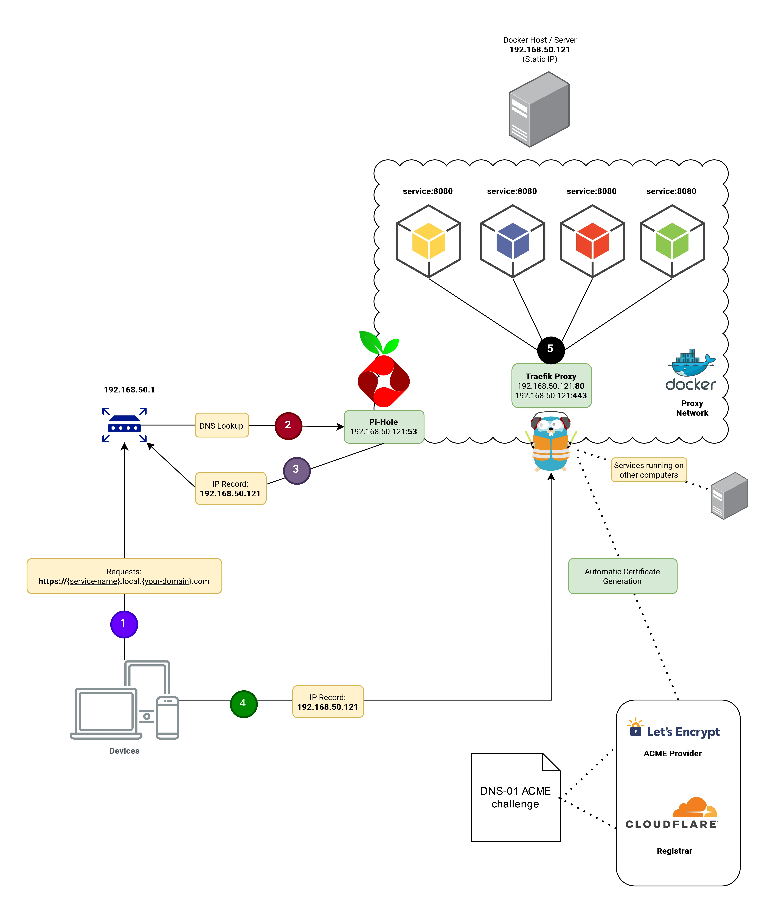

# Home Lab

Declarative Docker Compose configs for a self-hosted home lab. Every service sits behind a single
Traefik reverse proxy holding a wildcard certificate, so everything on the LAN is reachable over
HTTPS at `https://<service>.<domain>` without publishing a port or touching the internet.

There is no build step, no test suite and no application code here. Each service is one directory
under `services/` containing a `compose.yaml` that stands on its own, and deployment is
`docker compose up` per service against a single Ubuntu docker host.

The original setup followed [Techno Tim's](https://www.youtube.com/@TechnoTim) guide
[Put Wildcard Certificates and SSL on EVERYTHING](https://technotim.live/posts/traefik-portainer-ssl).
It covers Traefik, Portainer and the Cloudflare DNS challenge, which are still the parts hardest to
work out from the official docs alone. Everything else here came later.



## Layout

```text
services/
├── common.env.example       # shared values, copied to common.env
└── <name>/
    ├── compose.yaml         # always this name, never docker-compose.yaml
    ├── <name>.env.example   # only where a service has secrets of its own
    └── data/                # config templates copied to the host, a few services only
scripts/                     # host setup and the repo's own checks
systemd/                     # units that run on the host rather than in a container
```

Service data does not live in this repo. Bind mounts are rooted at `$BASE_VOLUME_DIRECTORY`, a host
path independent of the repo layout, so moving a service directory never moves its data. Named
volumes are preferred over bind mounts, and a bind mount has to justify itself with a named host
consumer: media served over Samba or FTP, config a human edits on the host, a socket.

## Prerequisites

- A docker host. See [Docker's documentation](https://docs.docker.com/engine/install) for
  installation. This lab runs [Ubuntu 22.04.3 LTS](https://releases.ubuntu.com/jammy); the build is
  on [PC-Part Picker](https://pcpartpicker.com/list/jW6prv).
- Access to your router, for local DNS and static IP assignment. This lab uses an
  [RT-AXE7800](https://www.asus.com/networking-iot-servers/wifi-routers/asus-wifi-routers/rt-axe7800/).
- A domain name you own, roughly $10 USD a year. This lab uses
  [CloudFlare](https://www.cloudflare.com/products/registrar), which the ACME DNS challenge needs an
  API token for.
- The env files. Copy each `*.env.example` to the same name without `.example` and fill it in.
  Shared values live in [services/common.env.example](./services/common.env.example); a service
  needing secrets of its own keeps a template beside its compose file, such as
  [services/traefik/traefik.env.example](./services/traefik/traefik.env.example). Each compose file
  header is the authoritative list of what that service needs. The repo-root `.gitignore` keeps
  every `*.env` untracked no matter which directory it ends up in.

## Host setup

Assign the docker host a static IP first, so DNS records do not have to be chased if the lease
changes. `hostname -I` reports the current address; ASUS documents
[assigning a static IP](https://www.asus.com/support/FAQ/1000906) and the steps are similar on other
routers.

Then create the network every service attaches to:

```bash
docker network create proxy
```

Traefik routes to containers over `proxy`, and stacks reach each other across it by container name.
HTTP services publish no ports at all as a result. The exceptions are services speaking something
other than HTTP, which need a published port to be reachable from the LAN: Traefik itself, Pi-Hole,
Plex, FTP, Kafka, Mongo, Postgres and Redis.

The remaining host preparation is manual and captured as scripts to read rather than to run blindly.
Each is a short list of commands with placeholders to fill in:

- [scripts/zfs-setup.sh](./scripts/zfs-setup.sh) creates the ZFS pools the bind mounts sit on.
- [scripts/samba.sh](./scripts/samba.sh) exports media and source trees to the LAN.
- [scripts/ssh.sh](./scripts/ssh.sh) disables root login and password authentication.

## Deploying a service

Always run from the repo root with explicit flags:

```bash
docker compose \
  --env-file "./services/common.env" \
  --file "./services/<service>/compose.yaml" up --detach
```

Add a second `--env-file` for a service that has one of its own. Pi-Hole, Traefik, Postgres and
SonarQube do:

```bash
docker compose \
  --env-file "./services/common.env" \
  --env-file "./services/traefik/traefik.env" \
  --file "./services/traefik/compose.yaml" up --detach
```

Both files have to be named. Compose would otherwise auto-load a `.env` from the compose file's own
directory, but passing any `--env-file` disables that lookup, so a service-level file is never
picked up on its own.

Stacks can equally be deployed from Portainer, which is why every bind mount uses an absolute host
path. A relative path resolves against the compose file's directory on the CLI, but against
Portainer's own container for stacks deployed there, so the same path reaches two different places
depending on who ran it.

## Validation

There is no test suite. The only check is that every compose file renders:

```bash
./scripts/validate-compose.sh
```

It derives a placeholder env file from the guards in the compose files themselves, runs
`docker compose config` over each one, and rejects any variable used without a `${VAR:?...}` guard
or a `${VAR:-default}`. Compose interpolates an unguarded missing variable to an empty string and
reports success, so without that second check a file can validate cleanly and still be broken. That
is how every service in this repo once published `Host(`<service>.local.`)` and stopped routing.

Shell scripts are checked separately, dispatching on the shebang since shellcheck refuses zsh:

```bash
./scripts/lint-shell.sh
```

Both run in CI on push and pull request, in [.github/workflows/lint.yml](./.github/workflows/lint.yml).

## Bringing the lab up

Order matters for the first three services only. Everything after that can start in any order.

### 1. Pi-Hole

On Ubuntu the container will not start while `systemd-resolved` holds port 53. Per the
[pi-hole documentation](https://github.com/pi-hole/docker-pi-hole#installing-on-ubuntu-or-fedora),
either disable the stub resolver:

```bash
sudo sed -r -i.orig 's/#?DNSStubListener=yes/DNSStubListener=no/g' /etc/systemd/resolved.conf
sudo sh -c 'rm /etc/resolv.conf && ln -s /run/systemd/resolve/resolv.conf /etc/resolv.conf'
sudo systemctl restart systemd-resolved
```

or disable the service outright:

```bash
sudo systemctl disable --now systemd-resolved.service
```

Then start it:

```bash
docker compose \
  --env-file "./services/common.env" \
  --env-file "./services/pi-hole/pi-hole.env" \
  --file "./services/pi-hole/compose.yaml" up --detach
```

The admin UI is at `http://${DOCKER_HOST_IP}/admin` until Traefik is up, and at
`https://pi-hole.$SERVICE_DOMAIN/admin` after. Point the router at it as the LAN's DNS server; ASUS
documents [configuring a custom DNS server](https://www.asus.com/support/FAQ/1045253/).

### 2. Traefik

```bash
docker compose \
  --env-file "./services/common.env" \
  --env-file "./services/traefik/traefik.env" \
  --file "./services/traefik/compose.yaml" up --detach
```

Read the compose file header before the first start. `acme.json` has to exist with `0600`
permissions, the `traefik.yml` and `config.yml` templates under
[services/traefik/data](./services/traefik/data) carry 🚨 placeholders to fill in on the host, and
every dollar in the bcrypt hash guarding the dashboard has to be doubled in the env file.

### 3. Portainer

```bash
docker compose \
  --env-file "./services/common.env" \
  --file "./services/portainer/compose.yaml" up --detach
```

## Adding a service

Copy the shape from [services/calibre-web/compose.yaml](./services/calibre-web/compose.yaml), the
current reference implementation. There is no `version:` key; the Compose Spec dropped it.

```yaml
# Documentation Reference:
# https://upstream.example.com/docs
#
# Required variables. Supply them however suits: common.env, a second
# --env-file, the shell environment, or Portainer's stack variables. Guarded,
# so Compose refuses to start rather than interpolating an empty string.
#
#   SERVICE_DOMAIN - Traefik host rules, e.g. local.example.com
services:
  service-name:
    image: "image-name:latest"
    container_name: "service-name"
    restart: "unless-stopped"
    security_opt:
      - no-new-privileges:true
    networks:
      - "proxy"
    volumes:
      - "service-name-data:/data"
    labels:
      - "traefik.enable=true"
      - "traefik.http.routers.service-name.entrypoints=http"
      - "traefik.http.routers.service-name.rule=Host(`service-name.${SERVICE_DOMAIN:?required, see header}`)"
      - "traefik.http.middlewares.service-name-https-redirect.redirectscheme.scheme=https"
      - "traefik.http.routers.service-name.middlewares=service-name-https-redirect"
      - "traefik.http.routers.service-name-secure.entrypoints=https"
      - "traefik.http.routers.service-name-secure.rule=Host(`service-name.${SERVICE_DOMAIN:?required, see header}`)"
      - "traefik.http.routers.service-name-secure.tls=true"
      - "traefik.http.routers.service-name-secure.service=service-name"
      - "traefik.http.services.service-name.loadbalancer.server.port=8080"
      - "traefik.docker.network=proxy"
networks:
  proxy:
    external: true
volumes:
  service-name-data:
```

Easy things to get wrong:

- A compose file must not depend on a particular env file, so list every variable it needs at the
  top with a one-line description and guard every use. The guard message says what the variable is,
  never where to put it.
- Quote any `environment:` entry containing a guard. A `: ` inside the message makes YAML parse the
  list item as a map. Use `-` rather than `:` in guard messages.
- The routing hostname is `<service>.$SERVICE_DOMAIN`. The `local.` prefix lives inside the value,
  so the label never reads `<service>.local.$SERVICE_DOMAIN`.

Add [`com.centurylinklabs.watchtower.enable=false`](https://containrrr.dev/watchtower/container-selection/)
to opt a container out of automatic updates. Nexus, Pi-Hole and SonarQube do, since their upgrades
migrate state in ways that cannot be rolled back.

## Scheduled host maintenance

Systemd units that run on the docker host rather than in a container live under
[systemd/](./systemd), one directory per task. Nothing in this repo installs them:

```bash
sudo cp ./systemd/docker-prune/docker-prune.{service,timer} /etc/systemd/system/
sudo systemctl daemon-reload
sudo systemctl enable --now docker-prune.timer

systemctl list-timers docker-prune.timer
```

### Docker Prune

Weekly prune of unused Docker images and build cache, Monday at 04:00, avoiding the Sunday-morning
ZFS scrub and `e2scrub_all` windows.

- [docker-prune.service](./systemd/docker-prune/docker-prune.service)
- [docker-prune.timer](./systemd/docker-prune/docker-prune.timer)
- [docker image prune - Documentation](https://docs.docker.com/reference/cli/docker/image/prune/)

The `until=168h` filter is deliberate: a blind `prune -a` would delete images for any compose stack
that happens to be down that week, forcing a re-pull.

Volume and container pruning are intentionally excluded. `docker volume prune` can destroy live
application data. Container pruning is the subtle one, since removing stopped containers makes their
images eligible for the image prune in the same run, so one invocation could cascade well past
intent.

`docker image prune` has no dry-run flag. To see how much is reclaimable beforehand, and to check
the unit after a run:

```bash
docker system df
sudo systemctl start docker-prune.service   # Trigger manually
journalctl -u docker-prune.service -n 50
```

## Services

### Audiobookshelf

> Self-hosted audiobook and podcast server.

The audiobook and podcast libraries stay bind mounts so the same trees remain reachable over Samba
and FTP. The container is pinned to uid 1000 so downloaded podcast episodes are not written as root.
Docker creates named volumes owned by root, so a one-shot init container chowns the config and
metadata volumes before the server starts; deploying is still a single `up --detach`.

- [compose.yaml](./services/audiobookshelf/compose.yaml)
- [Audiobookshelf - Docker install](https://www.audiobookshelf.org/docs/documentation/install/docker/)

### Beszel

> Simple, lightweight server monitoring with Docker stats, historical data, and alerts.

Two containers: the hub serving the web UI, and an agent collecting stats from the docker host. The
hub reaches the agent over a unix socket in a shared volume, so the agent listens on no port. The
agent needs the hub's public key, which only exists after the hub has run once, so the first deploy
takes two passes; see the compose file header.

- [compose.yaml](./services/beszel/compose.yaml)
- [Beszel - Getting started](https://beszel.dev/guide/getting-started)
- [Beszel - Agent installation](https://beszel.dev/guide/agent-installation)

### Calibre Web

> Calibre-Web is a web app that offers a clean and intuitive interface for browsing, reading, and downloading eBooks using a valid Calibre database.

- [compose.yaml](./services/calibre-web/compose.yaml)
- [Calibre Web - Installation Instructions](https://docs.linuxserver.io/images/docker-calibre-web/)

### Container Registry

> A stateless, highly scalable server side application that stores and lets you distribute Docker images.

The plain upstream registry. Nexus also serves a container registry, on
`container-registry.$SERVICE_DOMAIN`. Authentication uses a bcrypt htpasswd file generated on the
host; see the compose file header.

- [compose.yaml](./services/registry/compose.yaml)
- [Registry - Dockerhub](https://hub.docker.com/_/registry)
- [Registry - Deployment guide](https://distribution.github.io/distribution/about/deploying/)

### Dashdot

> A modern server dashboard, running on the latest tech, designed with glassmorphism in mind. It is intended to be used for smaller VPS and private servers.

- [compose.yaml](./services/dashdot/compose.yaml)
- [Dashdot - GitHub](https://github.com/MauriceNino/dashdot)
- [Dashdot - Documentation](https://getdashdot.com/docs/installation/docker-compose)

### Databasus

> A self-hosted database management and visualisation tool.

- [compose.yaml](./services/databasus/compose.yaml)
- [Databasus - GitHub](https://github.com/databasus/databasus)

### DNS

> CoreDNS is a DNS server that chains plugins.

Tailnet-only split DNS, so Tailscale clients resolve `*.$SERVICE_DOMAIN` to the docker host. Uses
`network_mode: host` to bind the tailscale0 interface, answers on port 53 rather than HTTP, and so
carries no Traefik labels.

This does **not** replace [Pi-Hole](#pi-hole). The two answer different clients for different
reasons: CoreDNS serves the tailnet and only resolves the lab's own hostnames, while Pi-Hole is the
LAN's resolver and does the ad blocking. Neither is redundant.

Generate the Corefile with
[generate-dns-config.sh](./services/dns/generate-dns-config.sh) before the first start; it holds the
real domain, so it is not kept in git.

- [compose.yaml](./services/dns/compose.yaml)
- [Design and setup notes](./services/dns/TAILSCALE.md)
- [CoreDNS - Manual](https://coredns.io/manual/toc/)

### FTP Server

> A very small and simple Docker image running an FTP server.

Publishes 20-21 for the control and active-data channels, plus 40000-40009 for passive mode, since
Traefik only proxies HTTP. `FTP_PUBLIC_IP` is the address handed to clients for passive connections,
so it has to be one they can reach.

- [compose.yaml](./services/ftp/compose.yaml)
- [FTP Server - Dockerhub](https://hub.docker.com/r/garethflowers/ftp-server)

### Garage

> An open-source distributed object storage service tailored for self-hosting.

S3-compatible object storage, replacing MinIO. Generate `garage.toml` with
[generate-garage-config.sh](./services/garage/generate-garage-config.sh) before the first start; it
holds the RPC secret and admin token, so it is not kept in git.

- [compose.yaml](./services/garage/compose.yaml)
- [Garage - Quick Start](https://garagehq.deuxfleurs.fr/documentation/quick-start/)
- [Garage - Real-world deployment](https://garagehq.deuxfleurs.fr/documentation/cookbook/real-world/)

### Ghost

> The world's most popular modern publishing platform for creating a new media platform.

Ghost plus MySQL. Only Ghost is routed. Ghost stores absolute URLs in post content and email, so
`url` has to match the hostname Traefik publishes.

- [compose.yaml](./services/ghost/compose.yaml)
- [Ghost - Dockerhub](https://hub.docker.com/_/ghost)
- [Ghost - Configuration](https://ghost.org/docs/config/)

### Homarr

> A simple, yet powerful dashboard for your server.

- [compose.yaml](./services/homarr/compose.yaml)
- [Homarr - Installation Instructions](https://homarr.dev/docs/getting-started/installation/docker)

### Jenkins

> The leading open source automation server

Runs the official image directly rather than building a local one. Docker access comes from the
mounted socket plus `group_add`, which needs `DOCKER_GID` set to the host's docker group id:

```bash
getent group docker | cut -d: -f3
```

Testcontainers talks to the Docker API over that socket and needs no CLI in the container. Pipeline
steps that shell out to `docker`, including `docker.build()`, do need one, so run those on a build
agent. Mounting the socket is equivalent to giving Jenkins root on the host.

- [compose.yaml](./services/jenkins/compose.yaml)
- [Jenkins - Dockerhub](https://hub.docker.com/r/jenkins/jenkins)
- [Testcontainers - Docker environment](https://java.testcontainers.org/supported_docker_environment/)

### Kafka

> A distributed event streaming platform.

A single KRaft node in combined broker and controller mode. Kafka speaks its own protocol rather
than HTTP, so there are no Traefik labels: other stacks reach it over `proxy` at `kafka:19092`, and
29092 is published for LAN clients. `KAFKA_ADVERTISED_HOST` is the address handed back to clients
after the initial handshake, so it has to be one they can reach.

Every listener requires SASL authentication, and the authorizer denies by default. `admin` is a
superuser; `app` authenticates but has no access to anything until ACLs are granted to it. The
compose file header has the commands.

- [compose.yaml](./services/kafka/compose.yaml)
- [Kafka - Dockerhub](https://hub.docker.com/r/apache/kafka)
- [Kafka - KRaft documentation](https://kafka.apache.org/documentation/#kraft)
- [Kafka - Authorization and ACLs](https://kafka.apache.org/documentation/#security_authz)

### Karakeep

> A self-hostable bookmark-everything app with a touch of AI for the data hoarders out there.

Three containers: the web app plus a headless Chrome for page capture and Meilisearch for full-text
search. Only the web app joins `proxy`. `KARAKEEP_SECRET` and `MEILI_MASTER_KEY` are both required;
rotating the former logs everyone out.

- [compose.yaml](./services/karakeep/compose.yaml)
- [Karakeep - Docker installation](https://docs.karakeep.app/Installation/docker)

### Kavita

> Kavita is a fast, feature rich, cross platform reading server.

Manga, comics and books stay bind mounts so the same trees remain reachable over Samba and FTP.

- [compose.yaml](./services/kavita/compose.yaml)
- [Kavita - Installation Instructions](https://wiki.kavitareader.com/installation/docker/)
- [Kavita - Dockerhub](https://hub.docker.com/r/jvmilazz0/kavita)

### Keycloak

> Open source identity and access management for modern applications and services.

Keycloak plus its own Postgres. Runs in production mode (`start`) rather than `start-dev`, with the
build step at container start so no local image has to be maintained. Traefik terminates TLS, so
`KC_HTTP_ENABLED` is on and `KC_PROXY_HEADERS` is `xforwarded`. The bootstrap admin credentials only
apply on the first start, before an admin account exists.

- [compose.yaml](./services/keycloak/compose.yaml)
- [Keycloak - Running in a container](https://www.keycloak.org/server/containers)
- [Keycloak - Reverse proxy configuration](https://www.keycloak.org/server/reverseproxy)

### Mautic

> Mautic is open-source marketing automation software.

Four containers: the web role, a worker, a cron role and MariaDB. Only the web role is routed.
`MAUTIC_SITE_URL` has to match the hostname Traefik publishes, or tracking pixels and email links
point somewhere unreachable.

- [compose.yaml](./services/mautic/compose.yaml)
- [Mautic - Docker images](https://github.com/mautic/docker-mautic)
- [Mautic - Installation](https://mautic.org/docs/en/getting_started/how_to_install_mautic.html)

### Mongo and Mongo Express

> MongoDB is a source-available, cross-platform, document-oriented database program.

Ships with the mongo-express web UI. The database itself publishes 27017 for LAN access, since
Traefik only proxies HTTP.

- [compose.yaml](./services/mongo/compose.yaml)
- [Mongo - Dockerhub](https://hub.docker.com/_/mongo)
- [Mongo Express - Dockerhub](https://hub.docker.com/_/mongo-express)

### n8n

> A workflow automation platform that combines AI with business process automation.

`N8N_HOST` and `WEBHOOK_URL` have to match the hostname Traefik publishes, or webhook URLs shown in
the editor point somewhere unreachable.

- [compose.yaml](./services/n8n/compose.yaml)
- [n8n - Docker installation](https://docs.n8n.io/hosting/installation/docker/)
- [n8n - Environment variables](https://docs.n8n.io/hosting/configuration/environment-variables/)

### Nexus Repository Manager

> Nexus by Sonatype is a repository manager that organizes, stores and distributes artifacts needed for development.

Serves two hostnames: the UI on `nexus.$SERVICE_DOMAIN` and its Docker registry connector on
`container-registry.$SERVICE_DOMAIN`. Excluded from Watchtower, since a major upgrade migrates the
database and cannot be rolled back.

- [compose.yaml](./services/nexus/compose.yaml)
- [Nexus Repository Manager - Dockerhub](https://hub.docker.com/r/sonatype/nexus3)

### Ollama and Open WebUI

> Open WebUI is an extensible, self-hosted AI interface. Ollama gets up and running with large language models locally.

Served on `ollama.$SERVICE_DOMAIN`, which reaches Open WebUI. Ollama itself carries no Traefik
labels, so other stacks call its API at `http://ollama:11434` over `proxy`. The compose project name
is pinned to `olama` to match the old directory spelling, so the model weights are not orphaned.

- [compose.yaml](./services/ollama/compose.yaml)
- [Open WebUI - Environment variables](https://docs.openwebui.com/getting-started/env-configuration/)
- [Ollama - Dockerhub](https://hub.docker.com/r/ollama/ollama)

### Paperless-ngx

> A community-supported supercharged document management system: scan, index and archive all your physical documents.

Five containers: the webserver plus Postgres, Redis, Gotenberg and Tika. Only the webserver joins
`proxy`; the rest are private to the stack. Documents are dropped into
`$BASE_VOLUME_DIRECTORY/paperless/data/consume` on the host.

- [compose.yaml](./services/paperless/compose.yaml)
- [Paperless-ngx - Setup](https://docs.paperless-ngx.com/setup/)
- [Paperless-ngx - Configuration](https://docs.paperless-ngx.com/configuration/)

### Pi-Hole

> Network-wide Ad Blocking

The LAN's DNS resolver, and where the ad blocking happens. Answers on port 53, which Traefik cannot
proxy, so its ports are published. Separate from [DNS](#dns), which is CoreDNS serving the tailnet
only; keep both. Bring-up steps are under
[Bringing the lab up](#1-pi-hole), since `systemd-resolved` has to be dealt with first.

Excluded from Watchtower: v6 was a breaking release and upgrades here should be deliberate.

- [compose.yaml](./services/pi-hole/compose.yaml)
- [Pi Hole Docker Quick Start](https://github.com/pi-hole/docker-pi-hole/#quick-start)
- [Documentation](https://docs.pi-hole.net/)
- [Firebox Ad Lists](https://firebog.net/)

### Plex

> Plex organises all of your personal media so you can enjoy it no matter where you are.

Publishes its own ports as well as sitting behind Traefik: clients on the LAN discover the server by
broadcasting on 1900/udp and the 32410-32414/udp range, which Traefik cannot proxy. Media stays on
bind mounts so it remains reachable over Samba and FTP.

- [compose.yaml](./services/plex/compose.yaml)
- [Plex - Docker images](https://github.com/plexinc/pms-docker)
- [Plex - Installation](https://support.plex.tv/articles/200288586-installation/)

### PLG Stack (Prometheus-Loki-Grafana)

Five containers in one stack rather than one combined container. `node_exporter` needs the host PID
namespace and a root filesystem mount, and Alloy needs the Docker socket; merging either would
extend that reach across the rest. Grafana's bind mount needs `chown 472` and Prometheus's needs
`chown 65534` on the host:

```bash
sudo chown -R 472:472 $BASE_VOLUME_DIRECTORY/grafana/data/
sudo chown -R 65534:65534 $BASE_VOLUME_DIRECTORY/prometheus/data/
```

Prometheus scrapes the Docker daemon itself, which needs the metrics endpoint enabled in
[daemon.json](https://docs.docker.com/config/daemon/) on the host:

```json
{
  "metrics-addr": "127.0.0.1:9323"
}
```

Log shipping is [Grafana Alloy](https://grafana.com/docs/alloy/latest/), which took over from
Promtail when Promtail reached end of life on 2 March 2026. Alloy reads container logs through the
Docker API rather than tailing `/var/lib/docker/containers`, so its config needs no JSON parsing or
tag regex to recover container names. Its debugging UI is on `alloy.$SERVICE_DOMAIN`.

- [compose.yaml](./services/plg/compose.yaml)
- [Loki - Installation Instructions](https://grafana.com/docs/loki/latest/installation/)
- [Grafana Alloy - Docker installation](https://grafana.com/docs/alloy/latest/set-up/install/docker/)
- [Prometheus - Installation Instructions](https://prometheus.io/docs/prometheus/latest/installation/)
- [Node Exporter - Installation Instructions](https://prometheus.io/docs/guides/node-exporter/)
- [Grafana - Installation Instructions](https://grafana.com/docs/grafana/latest/installation/docker/)

### Portainer

> Portainer is your container management software to deploy, troubleshoot, and secure applications across cloud, datacenter, and Industrial IoT use cases.

Deliberately passes `BASE_VOLUME_DIRECTORY` and `SERVICE_DOMAIN` into its own container, so stacks
deployed from within Portainer can resolve them too.

- [compose.yaml](./services/portainer/compose.yaml)
- [Portainer - Installation Instructions](https://docs.portainer.io/start/install-ce)

### Postgres and PgAdmin

> PostgreSQL is a powerful, open source object-relational database system, with pgAdmin as its administration and development platform.

Publishes 5432 for LAN access, since Traefik only proxies HTTP. Other stacks in and outside this
repo reach it over `proxy` as `postgres`. With bind mounts, pgAdmin's data directory needs its UID
and GID set to `5050`:

```bash
sudo chown -R 5050:5050 "$BASE_VOLUME_DIRECTORY/admin/data"
```

- [compose.yaml](./services/postgres/compose.yaml)
- [Setup notes](./services/postgres/README.md)
- [Postgres - Dockerhub](https://hub.docker.com/_/postgres)
- [PgAdmin - Dockerhub](https://hub.docker.com/r/dpage/pgadmin4)
- [Permission denied: '/var/lib/pgadmin/sessions' in Docker](https://stackoverflow.com/questions/64781245/permission-denied-var-lib-pgadmin-sessions-in-docker)

### qBittorrent over VPN

> A BitTorrent client, with WireGuard and a kill switch that drops any traffic outside the tunnel.

`QBIT_LAN_NETWORK` is the kill switch's allow list. The compose file appends the docker bridge range
to it, because Traefik reaches the container over `proxy` rather than from the LAN and would
otherwise be firewalled out by the container itself. Drop the WireGuard config at
`$BASE_VOLUME_DIRECTORY/qbit-mullvad/config/wireguard/wg0.conf`; that directory only exists after one
start/stop cycle, so the first run is expected to fail to connect.

Runs `privileged: true`, which the WireGuard path requires. `NET_ADMIN` alone is only enough for
OpenVPN.

- [compose.yaml](./services/qbit/compose.yaml)
- [binhex/arch-qbittorrentvpn - GitHub](https://github.com/binhex/arch-qbittorrentvpn)

### Redis

> The open source, in-memory data store used by millions of developers as a cache, vector database, document database, streaming engine, and message broker.

Publishes 6379 for LAN access, since Traefik only proxies HTTP. `config/redis.conf` and
`scripts/docker-entrypoint-init.sh` have to be copied to `$BASE_VOLUME_DIRECTORY/redis/` on the host
before the first start.

- [compose.yaml](./services/redis/compose.yaml)
- [Redis - Dockerhub](https://hub.docker.com/_/redis)
- [Redis - ACL documentation](https://redis.io/docs/latest/operate/oss_and_stack/management/security/acl/)

### Seerr

> Seerr is a free, open-source request management and media discovery tool that works seamlessly with
> your Jellyfin, Plex, or Emby server.

The successor to Overseerr and Jellyseerr, both deprecated; migrating from either renames the image
and the config keys, so it is not a tag bump. Plex is on `proxy`, so Seerr reaches it as `plex` on
32400 when configuring the server connection.

- [compose.yaml](./services/seerr/compose.yaml)
- [Seerr - Docker installation](https://docs.seerr.dev/getting-started/docker/)
- [Seerr - Migration guide](https://docs.seerr.dev/migration-guide/)

### Speedtest Tracker

> Speedtest Tracker is a self-hosted application that monitors the performance and uptime of your
> internet connection.

Runs on SQLite, so it is a single container with no bundled database. `SPEEDTEST_TRACKER_APP_KEY` is
required; generate it with `echo "base64:$(openssl rand -base64 32)"` and set it once, since rotating
it makes already-encrypted values unreadable.

- [compose.yaml](./services/speedtest-tracker/compose.yaml)
- [Speedtest Tracker - GitHub](https://github.com/alexjustesen/speedtest-tracker)
- [Speedtest Tracker - Docker Compose installation](https://docs.speedtest-tracker.dev/getting-started/installation/using-docker-compose)

### SonarQube

> the code quality tool for better code

Elasticsearch inside SonarQube needs a raised mmap count on the host. Set it in `/etc/sysctl.conf`
so it survives a reboot:

```text
vm.max_map_count = 262144
```

then apply it without one:

```bash
sysctl -w vm.max_map_count=262144
systemctl restart docker
```

Served on `sonar-qube.$SERVICE_DOMAIN`, not `sonarqube`. Excluded from Watchtower, since a major
upgrade migrates the database and cannot be rolled back.

- [compose.yaml](./services/sonarqube/compose.yaml)
- [SonarQube - Dockerhub](https://hub.docker.com/_/sonarqube)
- [What is the parameter "max_map_count" and does it affect the server performance?](https://access.redhat.com/solutions/99913)

### Stirling PDF

> A locally hosted web application that allows you to perform various operations on PDF files.

- [compose.yaml](./services/stirling-pdf/compose.yaml)
- [Stirling PDF - Production deployment guide](https://docs.stirlingpdf.com/Production-Deployment-Guide#docker-compose-setup)

### Traefik

> Traefik is the leading open-source reverse proxy and load balancer for HTTP and TCP-based applications that is easy, dynamic and full-featured.

The only ingress in the lab. Holds a wildcard certificate obtained over the Cloudflare DNS
challenge, so nothing has to be reachable from the internet for issuance. Routers for things that
are not containers, such as the router's own UI and Cockpit, live in the file provider at
[services/traefik/data/config.yml](./services/traefik/data/config.yml). Bring-up steps are under
[Bringing the lab up](#2-traefik).

- [compose.yaml](./services/traefik/compose.yaml)
- [Traefik - Dockerhub](https://hub.docker.com/_/traefik)
- [Traefik - ACME DNS challenge](https://doc.traefik.io/traefik/https/acme/#dnschallenge)

### Twenty CRM

> A modern CRM offering a powerful, customizable platform, built to be the open-source alternative to Salesforce.

Four containers: the server, a background worker, Postgres and Redis. Only the server is routed;
the rest are private to the stack. `TWENTY_APP_SECRET` signs sessions, so rotating it logs everyone
out.

- [compose.yaml](./services/twenty/compose.yaml)
- [Twenty - Self-hosting with Docker Compose](https://twenty.com/developers/section/self-hosting/docker-compose)
- [Twenty - GitHub](https://github.com/twentyhq/twenty)

### Vikunja

> The open-source, self-hostable to-do app.

Pinned to a specific version rather than `latest`, since major releases run one-way database
migrations on start. Task attachments live on a bind mount under `$BASE_VOLUME_DIRECTORY`.

- [compose.yaml](./services/vikunja/compose.yaml)
- [Vikunja - Full docker example](https://vikunja.io/docs/full-docker-example/)
- [Vikunja - Config options](https://vikunja.io/docs/config-options/)

### Watchtower

> A process for automating Docker container base image updates.

- [compose.yaml](./services/watchtower/compose.yaml)
- [Watchtower - Dockerhub](https://hub.docker.com/r/nickfedor/watchtower)
- [Documentation](https://watchtower.nickfedor.com/)
- [GitHub](https://github.com/nicholas-fedor/watchtower)
